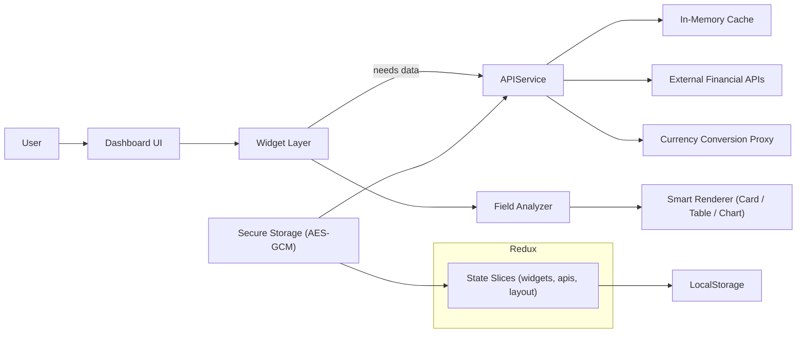

## Finance Dashboard (Frontend)

**Adaptive, secure, and extensible financial data workspace with smart widget intelligence.**  
*Connect market & currency APIs • Auto-generate visualizations • Persist & secure API keys • Explore JSON dynamically*

Links: [Demo](#demo) · [Features](#features) · [Architecture](#architecture) · [Tech Stack](#tech-stack) · [Roadmap](#roadmap)

---

## Demo

Live App: (placeholder – deploy URL)  
Video Walkthrough: (placeholder – Loom/YouTube link)


---

## Features

Core functionality:

- ✅ Smart widget type inference (auto card / table / chart selection from raw JSON)
- ✅ Hierarchical field explorer (nested objects & arrays with type detection)
- ✅ Secure API key encryption (AES‑GCM + device-derived key, masked display)
- ✅ Currency conversion via secure proxy + formatting utilities
- ✅ Responsive bento grid with drag‑and‑drop & expansion logic
- ✅ Table widgets: search, pagination, adaptive column formatting
- ✅ Chart widgets: numeric string parsing & adaptive chart selection
- ✅ Manual refresh + intelligent caching layer (avoids redundant calls)
- ✅ Persistent local storage hydration (stable pre-hydration gating)
- ✅ Theming (dark / light) + accessible semantic styling
- ✅ Inline API endpoint creation & re-use across widgets
- ✅ Widget reconfiguration (rename, reselect fields, change layout)
- ✅ Template system groundwork (API key injection + metadata integration)
- ✅ Import / export sharable dashboard configurations
- ✅ Sidebar navigation system & multi-page restructuring
- ✅ Advanced template marketplace & sharing
- ✅ Pluggable widget module architecture
- ✅ Shared template + layout export for collaboration


---

## Tech Stack

| Layer | Tool / Library | Why |
|-------|----------------|-----|
| Framework | Next.js (App Router) | File-based routing, server components, SSR/ISR flexibility |
| Language | TypeScript | Type safety, maintainability |
| Styling | Tailwind CSS + shadcn/ui | consistent design + reusable components |
| State (app) | Redux Toolkit | Central persistence (widgets, endpoints, layout) |
| Persistence | LocalStorage + controlled hydration middleware | Prevents race conditions & ensures atomic restore |
| Security | Web Crypto | Local encryption of API keys |
| Validation | Zod (via internal modules) | Input resilience + safer runtime checks |

---

## Architecture

High-level flow:



Component / Responsibility Map:


### Directory Overview

```
src/
	app/                # Next.js routes (home, dashboard)
	components/         # UI + feature components (modals, lists, widgets)
	hooks/              # Custom logic (API testing, encryption, field mapping, persistence)
	lib/                # Core service modules (api-service, storage, analyzer, exporters)
	store/              # Redux slices, middleware, root reducer
	types/              # Shared TypeScript contracts
	constants/          # Template, navigation, modal configuration metadata
```

### Key Concepts

1. Smart Rendering: Widget creation defers choosing a visualization until data shape analysis (array vs object vs scalar) completes.
2. Field Analyzer: Parses nested JSON → tree nodes with metadata (isArray, numeric, date-like, etc.) enabling context-aware UI.
3. Secure API Keys: Keys encrypted with AES-GCM using a derived per-device key; only decrypted transiently for outbound requests.
4. Controlled Hydration: Middleware blocks persistence writes until initial state restored to prevent destructive overwrites.
5. Adaptive Layout: Bento grid assigns variable spans to widget types (e.g. tables wider) with drag-and-drop ordering.
6. Caching Strategy: In-memory map keyed by endpoint + params; manual refresh bypasses cache.
7. Template System: Provides blueprint objects referencing required API keys; injects resolved keys at apply time.

---

## Data Lifecycle

1. User defines or selects an API endpoint (optionally via cURL parser) → stored in Redux & encrypted if key-bound.
2. Widget created referencing endpoint ID → fetch triggered via api-service.
3. Response analyzed → tree metadata generated → optimal display mode inferred (card, table, chart).
4. Renderer builds UI; user can expand, reconfigure, rename, or refresh.
5. State (widgets, layout, endpoints) persisted after hydration gate opens.

---

## Development

Install deps:
```bash
npm install
```

Run (local):
```bash
npm run dev
```

Build:
```bash
npm run build
```

Lint:
```bash
npm run lint
```

Type Check:
```bash
tsc --noEmit
```

---
